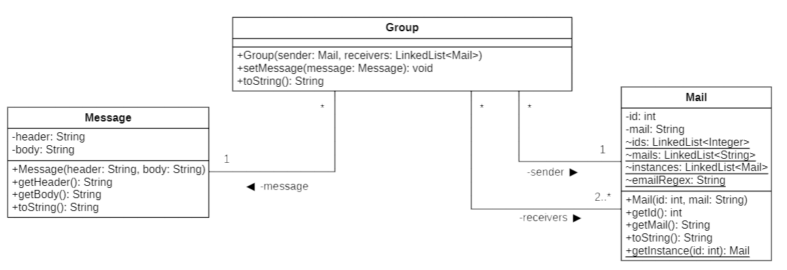

# E-Mails Pranks testing

This project if part of a Bachelor course on SMTP. The purpose of this project is to setup an SMTP server and create an SMTP client with the goal of sending forged mails.

## Implementation

Since the purpose of this project is to learn how SMTP works, no SMTP API shall be used and all details of the SMTP protocol are to be manually taken care in the client.

The client reads config files containing mails to be used as senders and receivers, as well as mail subjects and bodies. It then sends e-mails that will be caught by the SMTP server and can be read on it's HTTP interface.

### Client details

The Client uses the following classes to setup and send mails :


Mail contains a string for it's mail as well as an id to easily link mails to groups in .config files. Mail also contains lots of static attributes that are used to check that mails are valid and unique. It also gives a static method that allows to easily find a mail based on it's ID.

Message contains two strings, one for the header and one for the body.

Group contains a sender Mail, a list of receivers Mails and can contain a Message. Group also has a function to setup the message, also allowing to change the message. And finnaly there's a function sendMail() that is used to send the forged mail.

Data is read from the .config files in \\Client\\CONFIG\\.

### How to setup .config files

- mail.config :
    + Each line must have *```id, mail```* for each mail you want.
    + All ids and mails must be different.
    + Email must be valid according to this regex :
    ```[a-zA-Z0-9_+&*-](?:\\.[a-zA-Z0-9_+&*-])*@(?:[a-zA-Z0-9-]+\\.)[a-zA-Z]{2,7}$``` which is the regex in the Mail class's static variable *emailRegex*. It basically means :
        * First characters are alphanumeric or one of those characters : _+&*-
        * There can also be a dot separating the characters
        * Then a @ to seperate user and domain
        * Finally, domain must consist of any alphanumeric character or a minus
        * Followed by a dot and 2 to 7 alphabetical characters
- group.config :
    + Each line must have *```idSender, idReceiver1, idReceivers2```*
    + There has to be at least 2 receivers, so a minimum of 3 ids per line
    + You can add as much receivers as you want as long as you seperate them with a coma.
- message.config :
    + The first line is the header of a message
    + Then all of the following lines are the body.
    + Putting a simple dot alone on a line means that the message is complete and the next line will be the header of the next message.

## SMTP Server setup

In this part, we will see how to install a SMTP Server in a Docker container, here we will use a MockMock Server(https://github.com/DominiqueComte/MockMock)

This MockMock Server allows us to send e-mails without actually sending them which is perfect for this project.

The MockMock Server catches sent e-mails and blocks them from actually being sent. We are then able to see them on it's HTTP interface.

### Prerequisites
There are multiple prerequisites before installing the server:

- You need to have Docker, follow these instructions to install it (https://docs.docker.com/get-docker/)

- Install "openjdk" from the docker hub (https://hub.docker.com/_/openjdk) using the command (in terminal): 
```
docker pull openjdk
```

### Image Configuration

Once openjdk is installed, we will configure our Docker image using our Dockerfile and .jar file "*MockMock-1.4.1-SNAPSHOT.one-jar.jar*".

These files are located in the "*Docker*" folder.

The Dockerfile is already prepared and you don't need to modify it except if you want to change ports numbers for SMTP/Web Interface, if that's the case check our [Change ports](#how-to-change-ports) section.


### Building the container

Once the Dockerfile is ready, you will need to open a terminal and execute theses commands:

Access the Docker folder:
```
cd pathToTheDockerFolder
```

Build the Docker image:
```
docker build -t mockmockserver ./
```

The results should be like this:

 
 
### Running the container

At this stage, the mockmockserver Docker image has been created. Now we need to use the Docker run command to create a new container based on our Docker image.

In a terminal, execute this following command:
```
docker run -p 8282:8282 -t mockmockserver
```


If everything is working correctly, you should see something like this:

**In terminal:**


### How to check Docker images & containers:

**In terminal:**

Use the command ```docker image ls```:


**In Docker desktop**:

Containers:


Images:


Now, the MockMock server is running and can be used !

### MockMock details

This section contains some useful information about MockMock.

Basically, the default port 25 is used for the SMTP port and port 8282 for the web interface. It is important to note that on some systems, root permissions are required to listen on port 25. 

### How to change ports
If port 8282 is already in use on your machine, it is also possible to change this in the Dockerfile configuration.

In the Dockerfile, modify these line with new ports numbers:
```
EXPOSE newWebInterfacePort 
EXPOSE newSmtpPort
ENTRYPOINT ["java", "-jar", "MockMock-1.4.1-SNAPSHOT.one-jar.jar", "-p", "newSmtpPort", "-h", "newWebInterfacePort"]
```
Don't forget to only use unsused ports to avoid any issues.

After every changes in the Dockerfile, you will need to rebuild the image. Follow instructions from [Docker Image Build](#building-the-container).

And then, in a terminal, execute the following command to run the container:

```
docker run -p NewWebInterfacePort:NewWebInterfacePort -t mockmockserver
```
Change *NewWebInterfacePort* with the port number you want.

## How to use

First, make sure you've [setup the SMTP server](#smtp-server-setup) and that it's running.

Configure all the .config files in \\Client\\CONFIG\\. If you're not sure how to set them up, please [see our Client details sections](#client-details)

Once that's done, either :

- Open the Client folder in a Java IDE like IntelliJ and run the project 

or

- Launch a terminal and enter the following commands :

```
cd Path_to_Project\Client\
```
